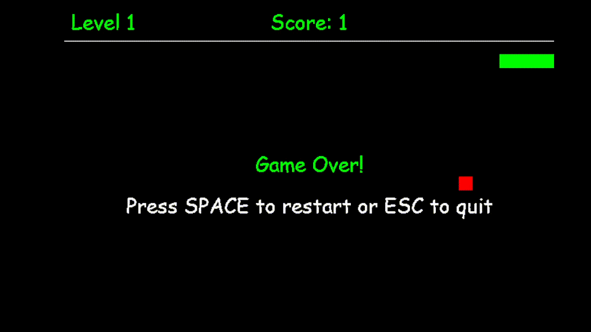

---

# Memory Snake

A classic snake game with a twist, strong emphasis on short term memory recall and a penalty system, as opposed to the conventional game.

## Goal

Progress through levels by eating red food to earn points. You must avoid the yellow bombs through memory recall, they appear briefly then disappear through a blackout effect. Colliding with a bomb costs you a portion of your length: 50% on your first hit, 80% on your second, and 95% on your third. A fourth hit ends the game. The higher the level, the more bombs appear, and you must maneuver your way through.

## Controls

Arrow keys to move.

## Speed

You can change the game speed by altering pygame.time.delay(). Higher means slower. 100 is the default.

## Dependencies

Pygame

## How to Run

Install pygame in your terminal, VS Code, or PyCharm:

```
pip install pygame
```

Then run the game:

```
python memory-snake.py
```

## Example



## Sources / References

- https://stackoverflow.com/questions/50534617/draw-a-line-in-pygame, pygame.draw.line syntax
- https://pygame.org/docs/ref/display.html#pygame.display.init, display module setup
- https://stackoverflow.com/questions/16044229/how-to-get-keyboard-input-in-pygame, KEYDOWN pattern for arrow keys
- https://www.pygame.org/docs/genindex.html, general pygame documentation reference
- https://www.geeksforgeeks.org/python/python-display-text-to-pygame-window/
- https://www.pygame.org/docs/ref/font.html#pygame.font.Font.render
- https://www.pygame.org/docs/ref/draw.html

---
